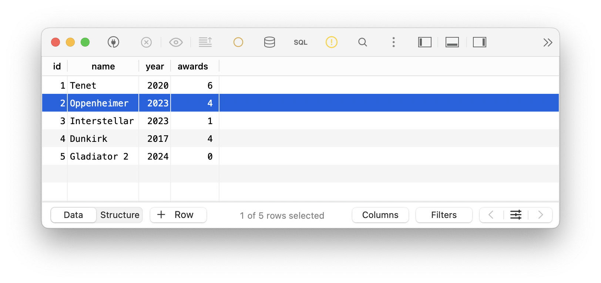

# DB-driven web-technology: Assignment 1

This document contains both theoretical and practical assignment
submission. 

Author: Filip Makara, S6163696, m.filip.2@student.rug.nl

The GitHub repository can be found at:
[https://github.com/makara-filip/rug-db-webtechnology/tree/main/assignment-1](https://github.com/makara-filip/rug-db-webtechnology/tree/main/assignment-1)

## MVC in a restaurant

The model-view-controller design pattern can be used in restaurants.
When a customer orders food, they are provided information about
available meals from the view (waiter or an interactive touch screen).
Through the view, customers can order food and the order is processed
by the controller, the business logic and manager of communication
between the model and the view. The controller reserves meal ingredients, 
stores the new available supplies into model storage.
It also interprets customer's orders (requests) and updates 
the model and the view. 
Model acts as a storage of supplies and when some run out,
the menu is updated dynamically to hide certain meals.

The MVC design pattern is useful because of separation of duty,
improved testing and scalability. Firstly, model, view and controller
are independent of each other. This makes it easier to maintain each
component separately without affecting the others.
Concerning scalability, the whole system can be enriched by new features
(e.g. online orders or food delivery to customers' homes) by updating
specific features elementary without modifying the entire system.
The same backend model storage can be used with entirely different systems
(food delivery vs. local restaurant).
With this kind of isolation, it's easier to test whether the components
are working correctly.

## Flask application: movie database

We can create the SQLite3 database in a file `movies.db`,
create the `movies` table and finally insert a few initial
rows. We enter the SQLite console with `sqlite3 movies.db`:

```sql
CREATE TABLE movies (
    id INTEGER PRIMARY KEY,
    name STRING NOT NULL,
    year INTEGER,
    awards INTEGER
);

INSERT INTO movies (name, year, awards) VALUES ("Tenet", 2020, 1);
INSERT INTO movies (name, year, awards) VALUES ("Oppenheimer", 2023, 4);
INSERT INTO movies (name, year, awards) VALUES ("Interstellar", 2015, 2);
INSERT INTO movies (name, year, awards) VALUES ("Dunkirk", 2017, 1);
```

The Flask application in `flask_appliaction_assignment.py`
file can be started by running `python3 flask_application_assignment.py`.

There are the following endpoints:

- `GET /index` renders the list of movies in a table,
- `GET /add_movie` renders the HTML to the client
with the appropriate movie data (pre-filled if the movie exists).
The `id` query parameter specifies which movie is being 
edited. If it's not present, a new movie is being drafted.
- `POST /add_movie` manipulates the database
by adding a new movie or editing an existing one.
When submitting, the client is redirected back to `/add_movie` page.
- `POST /delete_movie` deletes the movie identified by the
`id` query parameter and then redirects the user back to movie table page.
This POST method represents an irreversible operation, hence it cannot
be GET.

## New movie added

I have added a new movie `Gladiator 2` using the web interface.
The current state of the database is shown in the following screenshot.


